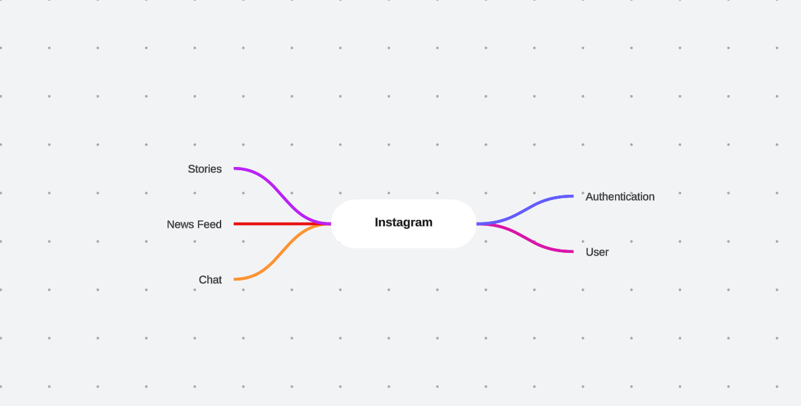

# Day 2

As we know that instagram is a microservices architecture , So i want 
to know what is the services is running on the backend and there is
a many and huge services which is running on the backend so we will re-build 
the architecture and not to use microservices and going to use monolithic architecture.

So we will define our mind map to structure the backend in the project.
And there is the mind map which i created.

This is a very small monlithic server as you see.

## Tools
Here is the tools which we will use it for implement the instagram clone.

1. **Python**
2. **Django**
3. **PostgreSQL**
4. **JWT**
5. **Celery**
6. **Redis**
7. **Web Socket**
8. **Daphne**
9. **Nginx**
10. **GraphQL**
11. **REST APIs**
12. **Docker**